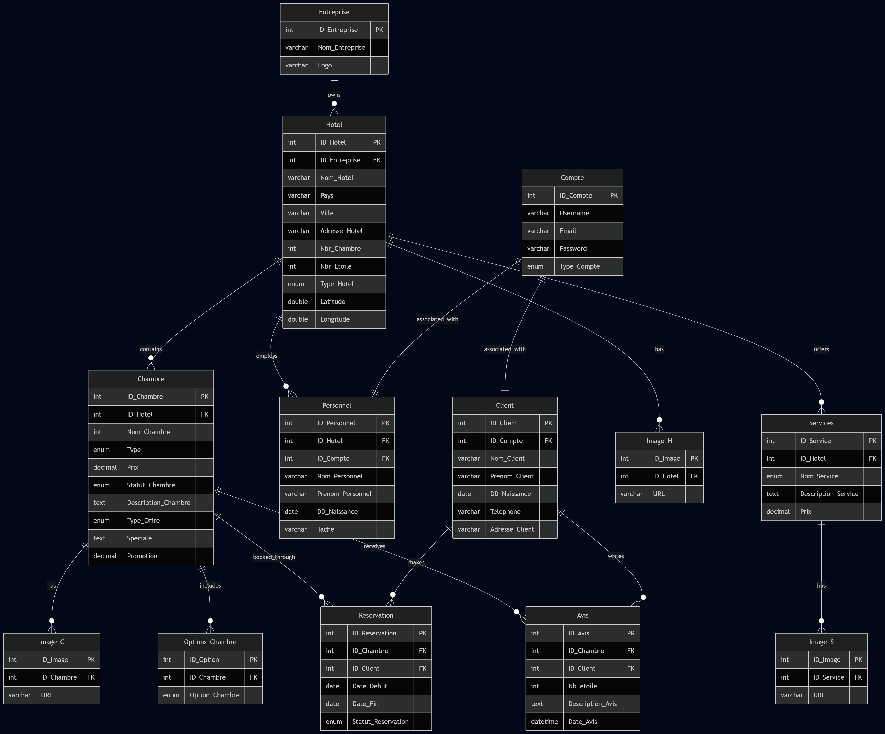

## Hotel Management & Reservation System
#### Development Period: February 2025 – April 2025

## Database Schema (ERD)

- Dual web and desktop application built to streamline hotel operations and reservations.
- Key Features: Room booking engine, guest services management, and real-time availability tracking.
- Tech Stack: Java (JavaFX), PHP, MySQL, HTML/CSS/JS
